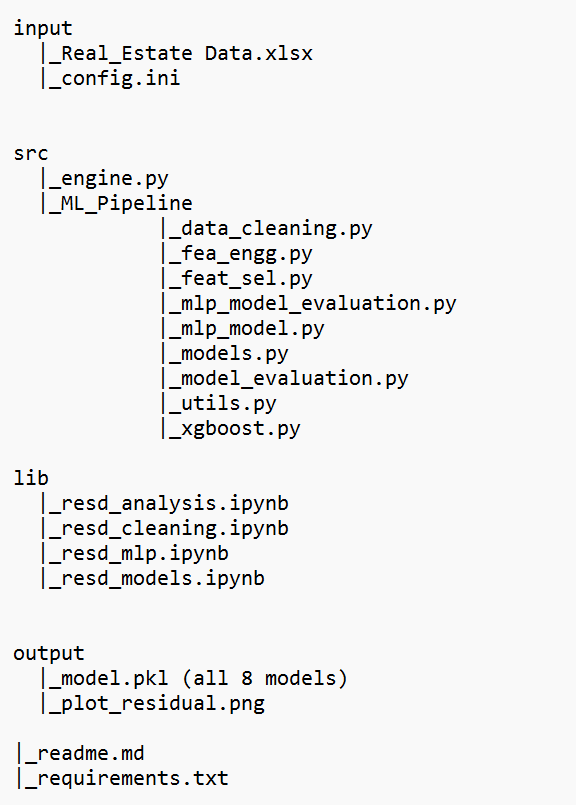

# Regression Models for House Price Prediction

## Table of Content
  * [Business Objective](#Business-Objective)
  * [Data Description](#Data-Description)
  * [Aim](#Aim)
  * [Tech stack](#Tech-stack)
  * [Approach](#Approach)
  * [Project Takeaways](#Project-Takeaways)

## Business Objective

The price of a house is based on several characteristics such as location, total area, number of rooms, various amenities available, etc.
In this project, we will perform house price prediction for 200 apartments in Pune city.
Different regression models such as Linear, Random Forest, XGBoost, etc., will be implemented. Also, multi-layer perceptron (MLP) models will be implemented using
scikit-learn and TensorFlow.
This house price prediction project will help you predict the price of houses based on various features and house properties.

## Data Description

We are given a real estate dataset with around 200 rows and 17 different variables that play an important role in predicting our target variable, i.e., price.

## Aim

The goal is to predict sale prices for homes in Pune city.

## Tech stack

**Language** - Python 
**Libraries** - sklearn, pandas, NumPy, matplotlib, seaborn, xgboost 

## Approach

1. Data Cleaning 
● Importing the required libraries and reading the dataset. 
● Preliminary exploration 
● Check for the outliers and remove outliers. 
● Dropping of redundant feature columns 
● Missing value handling 
● Regularizing the categorical columns 
● Save the cleaned data 

2. Data Analysis 
● Import the required libraries and read the cleaned dataset. 
● Converting binary columns to dummy variables 
● Feature Engineering 
● Univariate and Bivariate analysis 
● Check for correlation 
● Feature selection 
● Data Scaling 
● Saving the final updated dataset 

3. Model Building 
● Data preparation 
● Performing train test split 
● Linear Regression 
● Ridge Regression 
● Lasso Regressor 
● Elastic Net 
● Random Forest Regressor 
● XGBoost Regressor 
● K-Nearest Neighbours Regressor 
● Support Vector Regressor 
4. Model Validation 
● Mean Squared Error 
● R2 score 
● Plot for residuals 
5. Performs the grid search and cross-validation for the given regressor 
6. Fitting the model and making predictions on the test data< /br>
7. Checking for Feature Importance 
8. Model comparisons. 
9. MLP (Multi-Layer Perceptron) Models 
● MLP Regression with scikit-learn 
● Regression with TensorFlow 
## Screenshots

## Project Takeaways

1. Understanding the business problem. 
2. Importing the dataset and required libraries. 
3. Performing basic Exploratory Data Analysis (EDA). 
4. Data cleaning and missing data handling if required, using appropriate methods. 
5. Checking for outliers 
6. Using Python libraries such as matplotlib and seaborn for data interpretation and advanced visualizations. 
7. Splitting dataset into train and test data 
8. Performing Feature Engineering on data for better performance. 
9. Training a model using Regression techniques like Linear Regression, Random Forest Regressor, XGBoost Regressor, etc. 
10.Training multiple models using different Machine Learning Algorithms suitable for the scenario and checking for best performance. 
11. Performing grid search and cross-validation for the given regressor 
12.Making predictions using the trained model. 
13.Gaining confidence in the model using metrics such as MSE, R2 squared  
14.Plot the residual plots for train and test data 
15.Find those features that are most helpful for prediction using Feature Importance. 
16.Model comparison 
17.Learn how to build a Multi-Layer Perceptron model using the Scikit-learn library 
18.Learn how to build a Multi-Layer Perceptron model using TensorFlow
